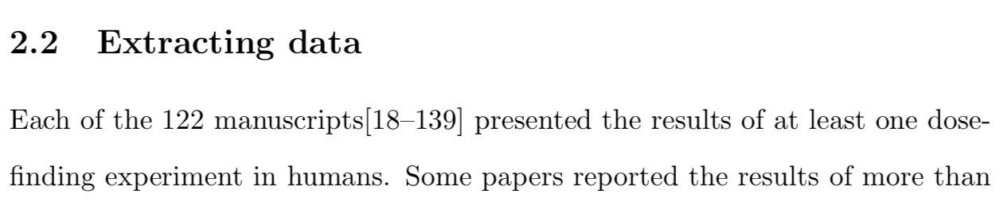

## Introduction
I was drafting a review recently where I wanted to cite 122 papers (the subjects of the review) in one reference.
Ordinarily, I use the citation managers [Zotero](https://www.zotero.org/) and [Mendeley](https://www.mendeley.com/).
I could have imported all 122 PDFs into Zotero and then output the citations in a BibTeX file.
However, that felt like too much manual work so I searched for a more automated way.

I had a list of 122 DOIs and I wanted the BibTeX entry for each.
My suspicion was that there would be an R package to automate this task.
That is how I stumbled across the `rcrossref` package by @rcrossref.

## Demonstration of `rcrossref`

`rcrossref` is on CRAN so you can install it in the usual way:
```{r, eval=FALSE}
install.packages('rcrossref')
```

Let me immodestly demonstrate the package by fetching a BibTeX entry for one of my own papers (my first, in fact).
You simply call the `cr_cn` function with the DOI you seek:

```{r, cache=TRUE}
library(rcrossref)

doi <- '10.1186/s12874-017-0381-x'
refs <- cr_cn(dois = doi, format = "bibtex")
```

The citation can be returned in one of many formats.
As stated, I want BibTeX.

Let's see the result:

```{r}
writeLines(refs)
```

Perfect.

## The bulk solution
Having fetched one example successfully, I imagined a viable solution would be to write a `for`-loop.
However, the solution I used was even simpler than that.
You can send in a vector of DOIs via the `dois` parameter.
Let me add another of my pivotal world-changing research papers to illustrate the point:

```{r, cache=TRUE}
doi <- c(
  '10.1186/s12874-017-0381-x',
  '10.1016/S2213-2600(20)30033-3'
)

refs <- cr_cn(dois = doi, format = "bibtex")
```

The `refs` object is now a `list` of two BibTeX entries.
Writing those references to a text stream is slightly more awkward than before:

```{r}
writeLines(unlist(lapply(refs, paste, collapse=" ")))
```

Having mastered that, however, writing the BibTeX entries to a file was a piece of cake:

```{r, eval=FALSE}
myfile = file('~/bibliography.bib')
writeLines(unlist(lapply(refs, paste, collapse=" ")), con = myfile)
```

Job done?
Not quite.

There was, in fact, one more challenge to overcome.
To cite the papers in $\LaTeX$, I would need the 122 citation keys, i.e. the identifying labels that come after the `@article{`.
We can see that CrossRef, the service that converts the DOI into a BibTeX citation, labels papers using the pattern `author_yyyy`.
I extracted the citation keys using a bit of [RegEx](https://en.wikipedia.org/wiki/Regular_expression) and the `stringr` and `purrr` packages:

```{r}
library(purrr)
library(stringr)

cite_keys <- refs %>% 
  map_chr(~ str_extract(.x, pattern = '\\@article\\{[A-Za-z_]*[0-9]+')) %>% 
  map_chr(~ str_extract(.x, pattern = '[A-Za-z_]*[0-9]+'))

cite_keys
```

I am not great at RegEx so I imagine there is a better way of doing that, but my method worked.
Importantly, the above will work with double-barreled names like `name1_name2_yyyy`.
Finally, I pasted the contents of `cite_keys` into my tex file.


## End product
This is the end result:



One hundred and twenty-two consecutive references compacted into one reference, as required.

## References

